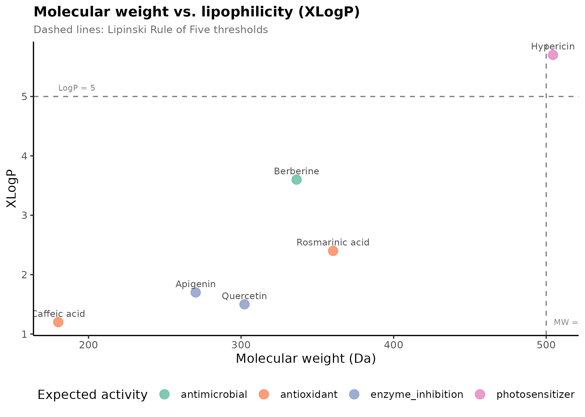
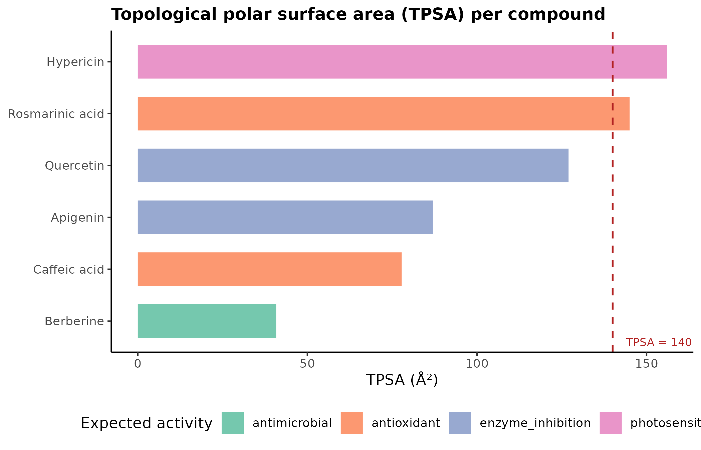

# PubChem Metabolite Descriptor Fetcher

Automated pipeline to pull physicochemical properties from the PubChem REST API, visualizing the drug-likeness of a compound library.

## Background

Evaluating drug-likeness of a compound library is the first step, which involves retrieving some conventional physicochemical parameters of compounds (MW, LogP, TPSA, HBD/HBA count) and screening it against the Rule of 5 and for oral bioavailability. The manual querying of these values in public databases at each library update is slow, laborious, prone to transcription errors, and a major bottleneck during compound prioritization.

## Implementation

This repo aims to automatically fetch and do initial analysis on the properties of a library of compounds. The main script, fetch_pubchem_properties.py, performs a two-stage query to the PubChem PUG REST API (resolve compound names to CIDs and then find the properties of each CID), implementing rate limiting and retry-with-backoff to ensure that requests will not fail permanently due to intermittent issues, and that the query complies with PubChem's access limits. The R script, visualize_properties.R, then plots out the library with regards to Lipinski and TPSA thresholds.

Note: `data/mock_data/compound_library_mock.csv` is only a placeholder *input* list used to demonstrate the pipeline — the compound names are illustrative, but the properties returned when you run the script are real values fetched live from PubChem, not fabricated.

## Technical Stack

| Component | Function |
|---|---|
| Python 3.10+ / requests, pandas | API communication, data parsing, tabular formatting |
| R 4.3+ / ggplot2, dplyr, readr | Visualization of chemical space against drug-likeness thresholds |
| PubChem PUG REST API | Source for physicochemical properties |

## Usage

```bash
pip install -r requirements.txt

python fetch_pubchem_properties.py --input data/mock_data/compound_library_mock.csv --output results/compound_properties.csv

Rscript visualize_properties.R
```

## File Structure

```
pubchem-metabolite-descriptor-fetcher/
├── data/
│   └── mock_data/
│       └── compound_library_mock.csv       # Example library for testing
├── results/                                # Output directory (generated on execution)
│   ├── compound_properties.csv
│   ├── lipinski_scatter.png
│   └── tpsa_barplot.png
├── tests/
│   └── test_fetch_pubchem_properties.py
├── fetch_pubchem_properties.py             # Main data retrieval script
├── visualize_properties.R                  # Visualization script
├── pyproject.toml
├── requirements.txt
├── .gitignore
└── README.md
```

## Example output

Run the pipeline against the mock compound library, then visualize:

```bash
python fetch_pubchem_properties.py --input data/mock_data/compound_library_mock.csv --output results/compound_properties.csv
Rscript visualize_properties.R results/compound_properties.csv results/
```




## Related repositories

- [cadd-fastapi-service](https://github.com/AmirSedaghaati/cadd-fastapi-service) — FastAPI service exposing descriptor fetching as an endpoint
- [vina-docking-pipeline](https://github.com/AmirSedaghaati/vina-docking-pipeline) — AutoDock Vina result parser and hit ranker
